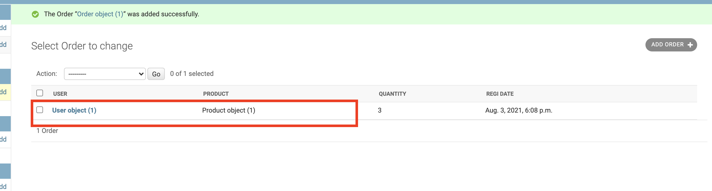

# Django Admin

- 해당 Object이름 개선

  각 모델별로, `__str__` return

  ```python
  class Order(models.Model):
      user = models.ForeignKey(
          'user.User', on_delete=models.CASCADE, verbose_name="USER")
      product = models.ForeignKey(
          "product.Product", on_delete=models.CASCADE, verbose_name="PRODUCT")
      quantity = models.IntegerField(verbose_name="QUANTITY")
      register_date = models.DateTimeField(
          auto_now_add=True, verbose_name="REGI DATE")
  
      #########THIS PART############
      def __str__(self):
          return str(self.user) + ' ' + str(self.product)
  ```

  

  

