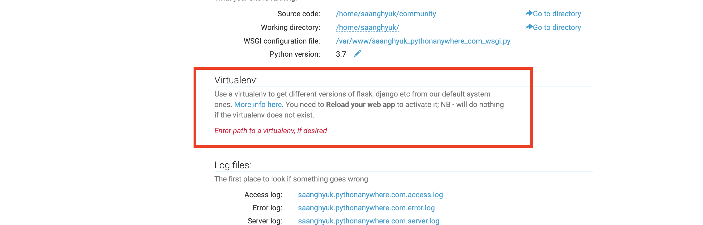
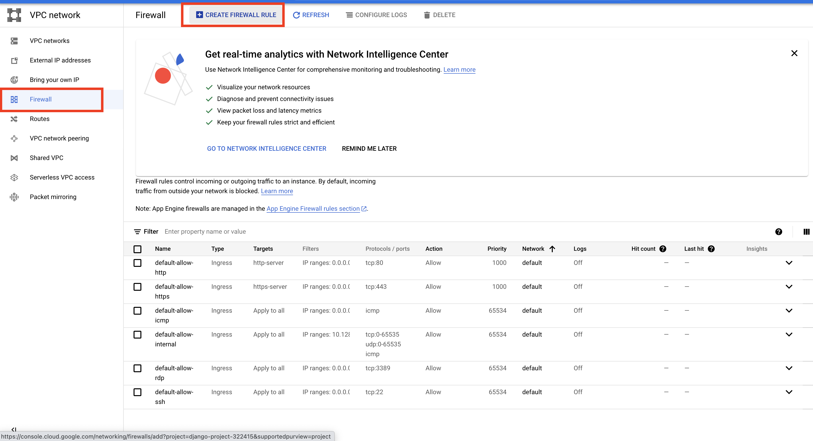

# Deploy

### python anywhere

1. Settings.py

   ```python
   DEBUG = False
   
   # python anywhere에 가입한 사용자 아이디
   # 다른 주소로 올리면 막히게 함. 
   # '*'로 해도 되긴 하는데, 이러면 모든 호스트를 다 받음. 
   ALLOWED_HOSTS = [
       'saanghyuk.pythonanywhere.com'
   ]
   
   
   # 우리는 이 static file들을 한 곳으로 다 모아주는 기능(배포서비스)을 활용한 후 
   # 배포 서비스 안에서 경로 지정하고 이용할 것. 
   # 고로, dirs를 주석처리
   STATIC_URL = '/static/'
   # STATICFILES_DIRS = [
   #     os.path.join(BASE_DIR, 'static')
   # ]
   STATIC_ROOT = os.path.join(BASE_DIR, 'static')
   
   ```

   

2. 그 다음 pythonanywhere로

   zip file 업로드

   

   그 다음 사진에서 바로 보이는, `Open Bash Console Here` 클릭

   bash 콘솔에서

   - `unzip community.zip` 압축 풀기

   - 가상환경 설정(python anywhere에는 기본으로 virtualenv 사용 가능)

     ```python
     # 가상환경 생성
     virtualenv --python=python3.7 community_env
     
     # 가상환경 활성화
     source community_env/bin/activate
     
     # django 설치
     pip install django
     ```

     

   - 프로젝트 내부로 들어가서, 필요한 명령어 실행. 

     ```python
     python manage.py collectstatic
     ```

   - DB Migration

     이때 Zip파일에 migrate(sqlite3 파일)파일까지 넣어 놨으면, makemigrations도 해야 함 

     ```python
     python manage.py makemigrations
     python manage.py migrate
     ```

   - Python Anywhere 설정

     파일에서 설정할 부분은 끝났음. 

     `exit`로 나가면 됨. 

     *web -> Add new app*

     

     *manual configuration* -> *python3.7*

     

     소스코드 경로 써주기. 

     아까 bash 콘솔에서 있던, 프로젝트의 경로 써주면 됨. 

     `/home/saanghyuk/community

     

​			

​		그 다음 WSGI configuration file 클릭

  ​		
  ​		현재는 Hello world보여주게 설정이 되어 있음.  하단 부분 주석처리

  					하단에 내리다 보면, 장고 설정이 있음. 거기서, 주석 풀고 source code path랑 settings path를 내 파일명으로 변경


​		아까 만들었던 virtualenv 경로 써주기

​		

​	

​			이렇게만 해놓고, 들어가면, 아래처럼만 나옴. 

​			

​		static을 수집 해놨는데, 그걸 연결 아직 안한거지. 

​		

​		이렇게 한다음에, 상단에서 reload를 하면 돼. 


## Google Cloud Platform

- 

  project만든 후, vm instance만들기. 

  

  

  ssh클릭하면 새로운 콘솔이 열림. 

  

  

  **이제 콘솔에서 설치.**

  Cent-os에는 Yum이 들어있다. 

   ```livescript
   sudo yum -y install epel-release
   
   sudo yum install -y https://repo.ius.io/ius-release-el7.rpm
   sudo yum update
   
   # 이제 파이썬이 찾아짐. 
   sudo yum list "*python36*"
   
   sudo yum install -y python36u python36u-libs python36u-devel python36u-pip
   ```

  

  가상환경 설정

  ```
  # python3.6 -m pip or pip3.6으로 실행
  sudo python3.6 -m pip install virtualenv 
  
  sudo python3.6 -m pip install -U pip
  
  ```

  코드 올리기

  우리가 작업한 폴더 압축(내부에 따로 config가 없나보네?)

  이 업로드를 하고 올리면 끝. 

  

  홈 폴더에 **zip** 파일이 생긴다. 

  ```
  unzip이 없어서 그것부터 설치해야 함. 
  sudo yum -y install unzip
  unzip shopping_mall.zip
  ```

  가상환경 설치. 

  ```
  python3.6 -m virtualenv django_env
  source django_env/bin/activate
  ```

  필요한 패키지 설치 

  가상환경 켜있으면, python/pip 실행해도 그냥 3대로 실행됨. 

  2.1에서 가장 최신버전

  ```
  pip install django==2.1.11
  pip install djangorestframework
  ```

  ```
  python manage.py runserver
  
  ```

  참고로 나는 이 과정에서 에러 있었음. [str관련](https://stackoverflow.com/questions/66193675/python-manage-py-runserver-typeerror-argument-1-must-be-str-not-windowspath). 

  

  이제 외부 IP받아서 8000포트로 접속 해봐도, 안되는 것도 아니고 오래 걸리다가 타임아웃 남. 

  

   1. 이유는 현재 runserver 방식이 127로 할때만 되는 방식임 

      ```
      python manage.py runserver 0.0.0.0:8000
      ```

  	2. 하나 더 해야지. 

      방화벽이 있어. 그 방화벽 해지해야지. 방화벽 종료

      ```python
      sudo systemctl stop firewalld
      ```

  	3. 그래도 또 안돼. 

      이제 구글 클라우드 플랫폼에 막혀 있는 거야. 

      클릭

      

      ​	현재 방화벽 규칙 보면, 열려있는거 같아 보이는거는 구글 내부에서 왔다갔다 할때 쓰는 ip만 열려 있는 거야. 

      

      

      

      그 다음 다시 Vminstance로  돌아간다. 

      현재 디폴트 네트워크 사용하고 있고, 우리가 방금 했던게 디폴트 네트워크의 firewall rules정한거였음. 문제 없지. 

  	4. 근데 또 에러나네?

      접속은 됬는데, 수정하라네. 

      

      ALLOWED HOST 수정해야 함. 

      

      **"*" 문자열 감싸야 함.** 

      

      http://34.126.149.21:8000/

      근데 현재 개발서버인데다가, 계속 띄워저 있어야돼. 대몬을 해야돼. 

      uwsgi -> python으로 된 어플리케이션을 배포할때 사용함. 

      ```python
      sudo yum -y install gcc
      pip install uwsgi
      ```

      잘 보면 가상환경 안에 bin 안에 생겼음. 

      

      이제 배포 하면 된다. 

      wsgi는 app 안에 원래 들어있더라?(settings있던 곳)

      ```
      uwsgi --http :8000 --home ~/shopping_mall/django_env --chdir ~/shopping_mal --module shopping_mall.wsgi
      ```

      이제 하나 남았음. **백그라운드로 실행** 시켜 줘야함. 데몬. 

      맨 앞에 nohub랑 맨 뒤에 & 쓰면 이게 그냥 데몬이야. 

      ```python
      nohub uwsgi --http :8000 --home ~/shopping_mall/django_env --chdir ~/shopping_mall --module shopping_mall.wsgi &
      ```
      
프로그래밍 실행될때 부여되는 고유 id가 생김. 
      

      
어떻게 확인 되냐면, 
      
```
      ps -ef | grep 2673
      ```
      

      
보이잖아. 
      
노헙은 실행되는 위치에 nohup.out이라는 파일을 만들고, 거기에 메세지들 보여 준다. 
      

      
supervisor처럼, 꺼지면 다시 실행시켜주는 서버 같은 것도 많이 쓴다. 

