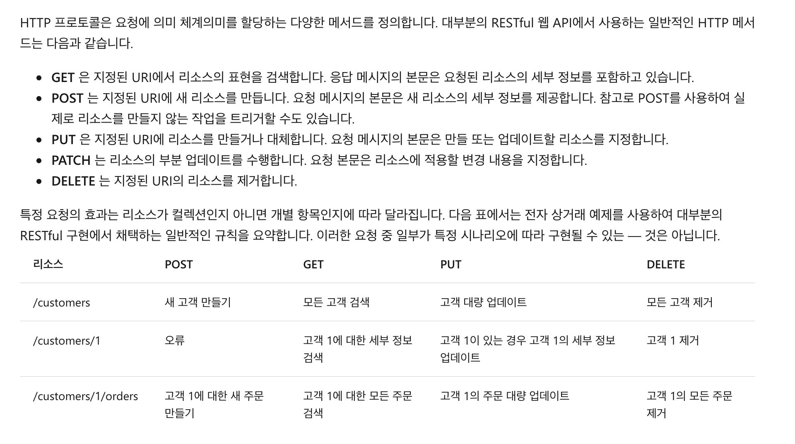

# Django Function

[Class View](###ClassView)

- **Many To Many**

  어느 모델에 정의해도 상관 없음. 주된 모델에 정의하면 Ok

  ```python
  class Board(models.Model):
  
      # 1:N Relationship
      writer = models.ForeignKey(
          'fcuser.Fcuser', on_delete=models.CASCADE, verbose_name='writer')
  		# N:M Relationship
      tags = models.ManyToManyField('tag.Tag', verbose_name='#Tag')


  ```

- **Get Or Create**

  해당 조건이 일치하면, 가지고 오고 아니면, 생성.

  앞에서는 생성 혹은 기존 객체, 두번째는 생성됬는지 여부 Boolean

  ```python

              for tag in tags:
                  if not tag:
                      continue
                  # IMPORTANT
                  _tag, created = Tag.objects.get_or_create(name=tag)
                  board.tags.add(_tag)

  ```

- ### ClassView

  장고 안에 기본적으로 만들어져있는 뷰들이 있다.

  [Class View Options](https://docs.djangoproject.com/en/3.2/topics/class-based-views/)

  어떻게 보여줄지만, html코드로 작성하면 된다.

- ### Humanize

  [django template builtin filter](https://docs.djangoproject.com/en/3.2/ref/templates/builtins/)

  html템플릿에서 여러 필터 사용할 수 있게 해줌. 예를 들어, 가격 3자리마다, 를 찍던가 날짜 형식을 바꾸던가.

  Settings에 등록하고 상단에 Load해야 사용 가능.

  _settings.py_

  ```python

  INSTALLED_APPS = [
  		...
      'django.contrib.humanize',
      ...
  ]

  ```

  HTML상단에

  ``

  예시:

  ```python
  <th scope="row">{{ product.price|intcomma }} Won</th>
  <th scope="row">{{ product.register_date|date:'Y-m-d H:i' }}</th>
  ```

  ```python
  # 사진 같은거 나오게 해줌.
  <li class="list-group-item">Description : {{ product.description|safe }}</li>
  ```

- Class 기반의 뷰에서 폼을 같이 넘길 때,

  ```python
  class ProductDetail(DetailView):
    template_name = 'product_detail.html'
    queryset = Product.objects.all()
    context_object_name = 'product'

    # 원하는 정보 같이 넣어서 전달하게 해주는 함수 제공.
    def get_context_data(self, **kwargs):
      context = super().get_context_data(**kwargs)
      context['form'] = OrderForm
      return context
  ```

- Form의 clean에서 여러가지 모델에 관한 처리 하는데, 이때 request.session을 못쓰는게 항상 문제임.

  **form에다가 리퀘스트를 같이 싣어 주는 코드.**

  지금 구조가, product_detail이라는 Html을 Product에 있는 view에서 만들면서, 그 안에 들어가는 폼뷰를 같이 쏴주는 형태. `get_context_data` 이걸로.

  일단 form 자체에서 **init**할때 리퀘스트 받아서 스스로 인스턴스에 저장할 수 있도록 생성자 함수 수정해주고,

  ```python
  forms.py
  # 생성자 수정해서, 폼이 만들어 지면서, request인자 받으면서 생성되도록

  class OrderForm(forms.Form):
      def __init__(self, request, *args, **kwargs):
        super().__init__(*args, **kwargs)
        self.request = request

      quantity = forms.IntegerField(error_messages={
          'required': "Please Select the Quantity"
      }, label="quantity")

      product = forms.IntegerField(
        label = "product", widget  = forms.HiddenInput
      )
  ```

  그리고, 이 폼 만들어 주는 곳에서 Init을 하기로 했으면, 실제로 만드는 곳에서 이걸 넣어 줘야지.

  ```Python
  # 폼이 만들어 지면서, 리퀘스트 정보를 넣어서 그 채로 템플릿으로 보내준다.

  class ProductDetail(DetailView):
    template_name = 'product_detail.html'
    queryset = Product.objects.all()
    context_object_name = 'product'

    # 원하는 정보 같이 넣어서 전달하게 해주는 함수 제공.
    def get_context_data(self, **kwargs):
      context = super().get_context_data(**kwargs)
      context['form'] = OrderForm(self.request)
      return context
  ```

  근데 지금 이 폼의 POST는 또, /order/create가 라는 다른 url에서 받고 있는데,

  얘는 order앱의 view에서 정의되 있음 여기서도, 수정 해야함. 거기까지도 수정해 줘야 함.

  ```python
  # 받는 쪽에서도, 받은 다음에 다시 form으로 보내서 거기서 검증을 하는데,
  # 그때 다시 form이 받을 수 있도록, kw에 싣어서 보내주는 것.

  class OrderCreate(FormView):
      form_class = OrderForm
      success_url = '/product/'

      def get_form_kwargs(self, **kwargs):
        kw = super().get_form_kwargs(**kwargs)
        kw.update({
          'request' : self.request
        })
        return kw
  ```

- #### Django Transaction

  하나의 단위, transaction은 일련의 여러 동작을 하나의 단위로 만들겠다는 뜻.

  전체가 성공이면 성공이고, 그 중에 하나라도 실패하면 실패. 다시 롤백함. DB에서 제공하는 기능.
  
  ```python
      if quantity and user and product:
              with transaction.atomic():
                  prod = Product.objects.get(pk=product)
                  order = Order(
                  quantity=quantity,
                  product =prod,
                  user = User.objects.get(email=user)
                  )
                  order.save()
                  prod.stock -= quantity
                  prod.save()
  ```


- #### Django Find Model 

  [Django Query](https://eunjin3786.tistory.com/338)

  ```python
  def get_queryset(self, **kwargs):
          queryset = Order.objects.filter(user__email=self.request.session.get('user'))
          return queryset
  ```

  


- #### Decorator

  함수를 Wrapping해서 기능을 재사용하게 해준다. 

  

```python
def login_required(function):
  def wrap():
    print('login_required')
    return function()
  return wrap
```


데코레이터는 원래 함수에 넣는 거잖아. 근데 class에도 넣을 수 있음. 

원래는 Class view를 열면서 호출하는 함수가 있음. **dispatch**라는 함수. 

그걸 오버라이드 하면서 원래는 그 위에다가, 데코레이터 쓰면 됨. 

그런데, 장고에서는 이걸 자동으로 해주는것도 제공해줌. 

```python
from django.utils.decorators import method_decorator
```

```python
@method_decorator(login_required, name='dispatch')
class OrderList(ListView):
    # model = Order
    template_name = 'order.html'
    context_object_name = 'order_list'

```

근데 사실 이렇게만 해놓으면 에러 발생. why? dispatch함수 원래 실행시킬때, 들어가던 파라미터들이 있을 꺼 아녀. 그런애들을 지금 싹다 무시한 상태. 

원래 파라미터들 싣어줘야지

```python
def login_required(function):
  def wrap(request, *args, **kwargs):
    user = request.session.get('user')
    if user is None or not user:
      return redirect('/login/')
    else:
      return function(request, *args, **kwargs)
  return wrap

```

심지어는, 다른 데코레이터에도 데코레이터를 달 수 있음. 

```python
@login_required
def admin_required(function):
    def wrap(request, *args, **kwargs):
      user = request.session.get('user')
      if user is None or not user:
        return redirect('/login/')
      else:
        return function(request, *args, **kwargs)
  return wrap
```


- 지금까지는 벡엔드와 프론트엔드가 공존했음. 

  프론트, 백에서 서로 응답하면서 html을 반응함. html로 반응함. 

  

  

  ​	

  ​					

- #### Django Rest Framework

  [rest api에 대한 설명 필독](https://docs.microsoft.com/ko-kr/azure/architecture/best-practices/api-design)

  [Django Rest API docs](https://www.django-rest-framework.org/)

  RestAPI의 Url은 명사 위주로 해야 한다. 

  

  

  

  

  

- *pip install djangrestframework*

  이후 Settings에서 등록해야 사용 가능. 

  ```python
  INSTALLED_APPS = [
      'django.contrib.admin',
      'django.contrib.auth',
      'django.contrib.contenttypes',
      'django.contrib.sessions',
      'django.contrib.messages',
      'django.contrib.staticfiles',
      'django.contrib.humanize',
      'rest_framework',
      'order',
      'product',
      'user'
  ]
  ```

  

- Serializer와 Mixin에 대한 설명 

  [Serializer 정리](https://velog.io/@phyyou/DRF-%EA%B3%B5%EB%B6%80%ED%95%98%EA%B8%B0-7-GenericAPIView%EC%99%80-Mixins)

