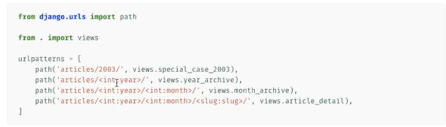
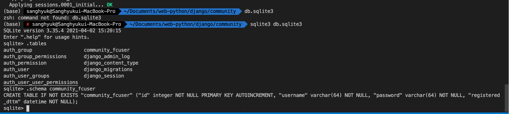

# Django 


### MVC

- **Model** : DB와의 연결

  - class 만 만들면, Django에서 알아서 쿼리문을 작성해줌. 프레임웍 안에서 모두 해결 가능. 
  - 다만, 더 심화된 문법을 원하는 경우 `Raw SQL` 을 제공. 

- **View** : Business Logic 

  - Url 파싱, Request, Response etc.

    

  - 

- **Template** : HTML
  - HTML 이지만, 안에서 Python 문법을 사용할 수 있게 만들어줌. 


### Environment/Settings	

- `pip install virtualenv`
- `virtualenv django_venv`

- `source django_venv/bin/activate`

- ```python
  pip install django
  ```

- `django-admin startproject community`

- `cd community` -> `django-admin startapp board`

- **community가 프로젝트, App은 MVC의 단위**
- 서로서로 참조해서 사용할 수 있지만, 분리해서 관리하게 됨. 


### MVC패턴

- Templates은 어디다 만들어도 상관은 없지만, 기본적으로는 앱 안에 폴더로 만들고 있음. 장고에서 이곳을 바라보고 있음. 

- 앱 프로젝트에 등록

  community -> settings.py -> INSTALLED_Apps

  아래처럼 migration 후에, 확인 가능. 

  


### 데이터베이스 관리 

- ```
  python manage.py makemigrations 
  
  python manage.py migrate 
  ```

- 


### ADMIN

- `python manage.py runserver`

- `python manage.py createsuperuser`

- admin.py

  
