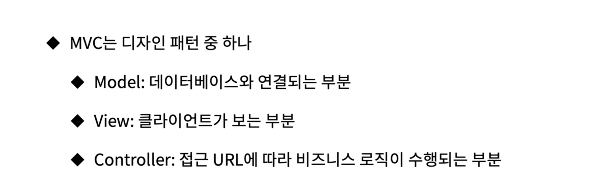

# Flask


- #### MVC Pattern

  Flask는 꼭 MVC패턴을 사용해야 하는 것은 아님. 

  다만, FLASK를 이용해서 MVC를 만들 수 있다는 것. 작은 앱에서는 그런게 필요 없지만, 관리가 필요할 때 사용함. 

  

  

- #### SQLAlchemy

  [Library](https://flask.palletsprojects.com/en/2.0.x/patterns/sqlalchemy/)

  ```python
  import os
  from flask import Flask
  from flask_sqlalchemy import SQLAlchemy
  import sqlalchemy
  
  basedir = os.path.abspath(os.path.dirname(__file__))
  dbfile = os.path.join(basedir, 'db.sqlite')
  app = Flask(__name__)
  # Connect
  app.config['SQLALCHEMY_DATABASE_URI'] = 'sqlite:///' + dbfile
  # 사용자가 정보 요청 하고, 우리가 전달 했으면 딱 그 순간에 나오는게 TEARDOWN
  # 끝날때마다 커밋을 하겠다는 것.
  app.config['SQLALCHEMY_COMMIT_ON_TEARDOWN'] = True
  app.config['SQLALCHEMY_TRACK_MODIFICATIONS'] = False
  
  # 이제 최상위변수 db라는 변수를 통해서 db를 사용하게 되는 것
  db = SQLAlchemy(app)
  
  
  class Test(db.Model):
      __tablename__ = 'test_table'
      id = db.Column(db.Integer, primary_key=True)
      name = db.Column(db.String(32), unique=True)
  
  
  db.create_all()
  
  
  @app.route('/')
  def hello():
      return 'hello world!'
  
  ```

  

- #### JInja2

  Flask가 설치될때, 같이 설치됨. 내부에서 이미 사용중임. 