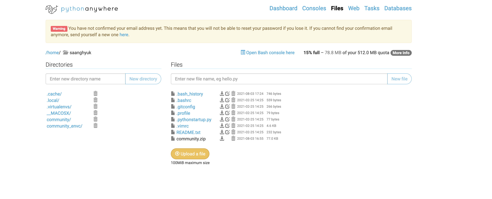
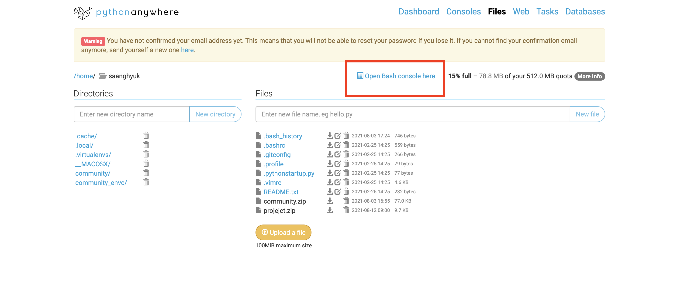
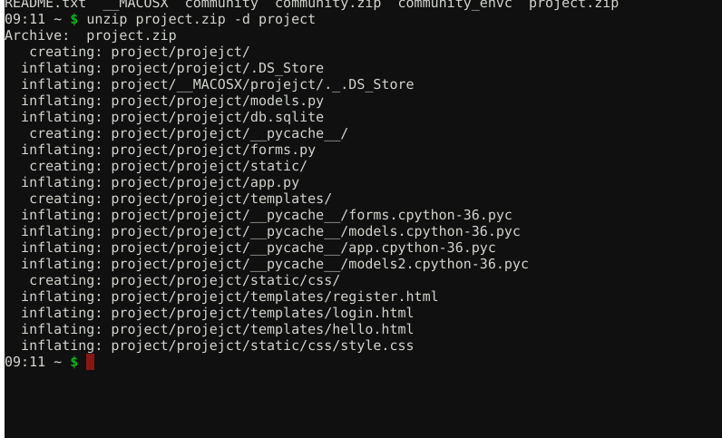
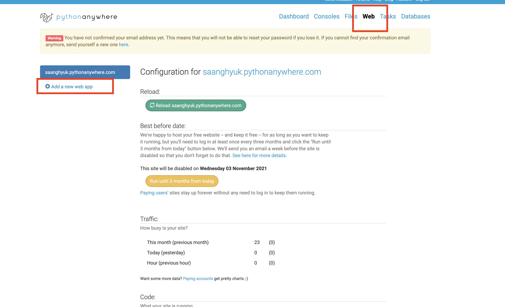
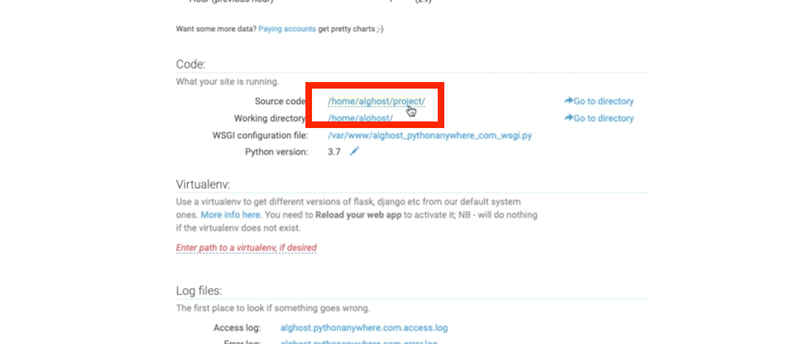
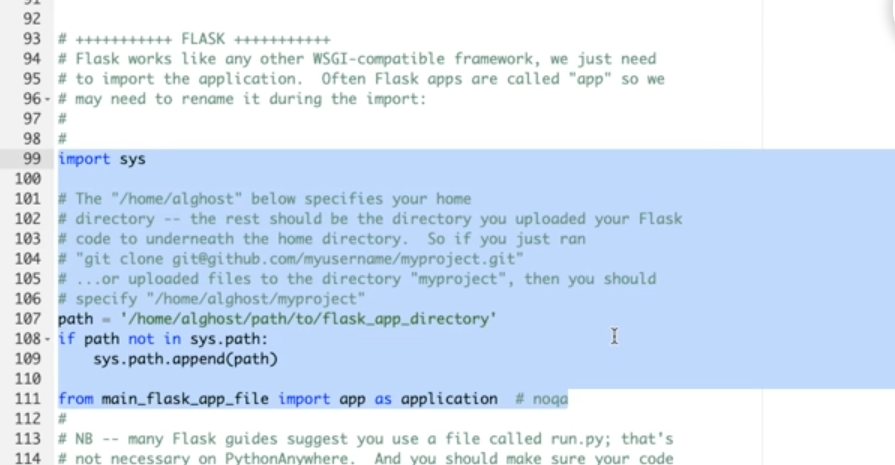
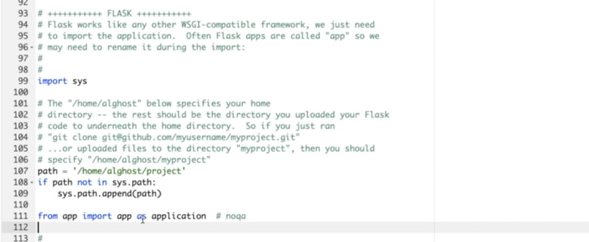

# Flask Deployment

- 내부 파일 고치기 

  ```python
  
  if __name__ == "__main__":
      basedir = os.path.abspath(os.path.dirname(__file__))
      dbfile = os.path.join(basedir, 'db.sqlite')
  
      app.config['SQLALCHEMY_DATABASE_URI'] = 'sqlite:///' + dbfile
      app.config['SQLALCHEMY_COMMIT_ON_TEARDOWN'] = True
      app.config['SQLALCHEMY_TRACK_MODIFICATIONS'] = False
      # CSRF SETTING
      app.config['SECRET_KEY'] = 'sadlkjf;klasjdfkl;ajsldk;f'
      csrf = CSRFProtect()
      csrf.init_app(app)
  
      db.init_app(app)
      db.app = app
      db.create_all()
  
      app.run(host='127.0.0.1', port=5000, debug=True)
  
  ```

  이렇게 쓴것은, `python app.py`로 실행할때가 기준

  ```python
  basedir = os.path.abspath(os.path.dirname(__file__))
  dbfile = os.path.join(basedir, 'db.sqlite')
  
  app.config['SQLALCHEMY_DATABASE_URI'] = 'sqlite:///' + dbfile
  app.config['SQLALCHEMY_COMMIT_ON_TEARDOWN'] = True
  app.config['SQLALCHEMY_TRACK_MODIFICATIONS'] = False
  # CSRF SETTING
  app.config['SECRET_KEY'] = 'sadlkjf;klasjdfkl;ajsldk;f'
  csrf = CSRFProtect()
  csrf.init_app(app)
  
  db.init_app(app)
  db.app = app
  db.create_all()
  
  if __name__ == "__main__":
      app.run(host='127.0.0.1', port=5000, debug=True)
  
  ```

  이렇게 고치면, 윗 부분의 설정 부분은 무조건 실행되고, if `__name__="__main__"` 이 부분은 어차피 배포되면 실행 안됨. 

- 파일 압축하기 

- **pythonanywhere가서 project.zip파일 업로드**

  

  파일 업로드 후, 현재 위치에서 bash console열기 

  

  `unzip project.zip -d project` "project라는 폴더에다가 압축을 풀겠다."

  

  가상환경 설정

  `virtualenv --python=python3.7 flask_env `

  `source flask_env/bin/activate`

  `pip install flask flask-wtf flask-sqlalchemy flask-jwt`

  exit누르고 나온다. 

  

  

  **Manual Configuration -> Python3.7**

  **내 소스코드 위치 명시**

  

  

  바로 아랫줄 WSGI를 클릭, 기존에 주석 풀려있던것 주석처리. 

  FLASK 부분 주석해지. 

  

  그리고, 프로젝트에 맞춰서 값으로 

  

  이제 다시 아까 web화면으로 와서 환경설정만 하면 된다. 

  Virtualenv설정

  

  **Reload** 누르고, 주소로 들어가면된다. 

  