# Flask Deployment

- 내부 파일 고치기 

  ```python
  
  if __name__ == "__main__":
      basedir = os.path.abspath(os.path.dirname(__file__))
      dbfile = os.path.join(basedir, 'db.sqlite')
  
      app.config['SQLALCHEMY_DATABASE_URI'] = 'sqlite:///' + dbfile
      app.config['SQLALCHEMY_COMMIT_ON_TEARDOWN'] = True
      app.config['SQLALCHEMY_TRACK_MODIFICATIONS'] = False
      # CSRF SETTING
      app.config['SECRET_KEY'] = 'sadlkjf;klasjdfkl;ajsldk;f'
      csrf = CSRFProtect()
      csrf.init_app(app)
  
      db.init_app(app)
      db.app = app
      db.create_all()
  
      app.run(host='127.0.0.1', port=5000, debug=True)
  
  ```

  이렇게 쓴것은, `python app.py`로 실행할때가 기준

  ```python
  basedir = os.path.abspath(os.path.dirname(__file__))
  dbfile = os.path.join(basedir, 'db.sqlite')
  
  app.config['SQLALCHEMY_DATABASE_URI'] = 'sqlite:///' + dbfile
  app.config['SQLALCHEMY_COMMIT_ON_TEARDOWN'] = True
  app.config['SQLALCHEMY_TRACK_MODIFICATIONS'] = False
  # CSRF SETTING
  app.config['SECRET_KEY'] = 'sadlkjf;klasjdfkl;ajsldk;f'
  csrf = CSRFProtect()
  csrf.init_app(app)
  
  db.init_app(app)
  db.app = app
  db.create_all()
  
  if __name__ == "__main__":
      app.run(host='127.0.0.1', port=5000, debug=True)
  
  ```

  이렇게 고치면, 윗 부분의 설정 부분은 무조건 실행되고, if `__name__="__main__"` 이 부분은 어차피 배포되면 실행 안됨. 

- 파일 압축하기 

- **pythonanywhere가서 project.zip파일 업로드**

  

  파일 업로드 후, 현재 위치에서 bash console열기 

  

  `unzip project.zip -d project` "project라는 폴더에다가 압축을 풀겠다."

  

  가상환경 설정

  `virtualenv --python=python3.7 flask_env `

  `source flask_env/bin/activate`

  `pip install flask flask-wtf flask-sqlalchemy flask-jwt`

  exit누르고 나온다. 

  

  

  **Manual Configuration -> Python3.7**

  **내 소스코드 위치 명시**

  

  

  바로 아랫줄 WSGI를 클릭, 기존에 주석 풀려있던것 주석처리. 

  FLASK 부분 주석해지. 

  

  그리고, 프로젝트에 맞춰서 값으로 

  

  이제 다시 아까 web화면으로 와서 환경설정만 하면 된다. 

  Virtualenv설정

  

  **Reload** 누르고, 주소로 들어가면된다. 

  


#### Google Cloud Platform

- 프로젝트를 만들고 거기로 넘어간다. 
- 인스턴스 만들기. 
  - 만들 때, **HTTP, HTTPS 트래픽 허용 해줘야함. **
- SSH버튼 누르면, 바로 브라우져로 터미널 접속 가능하다. 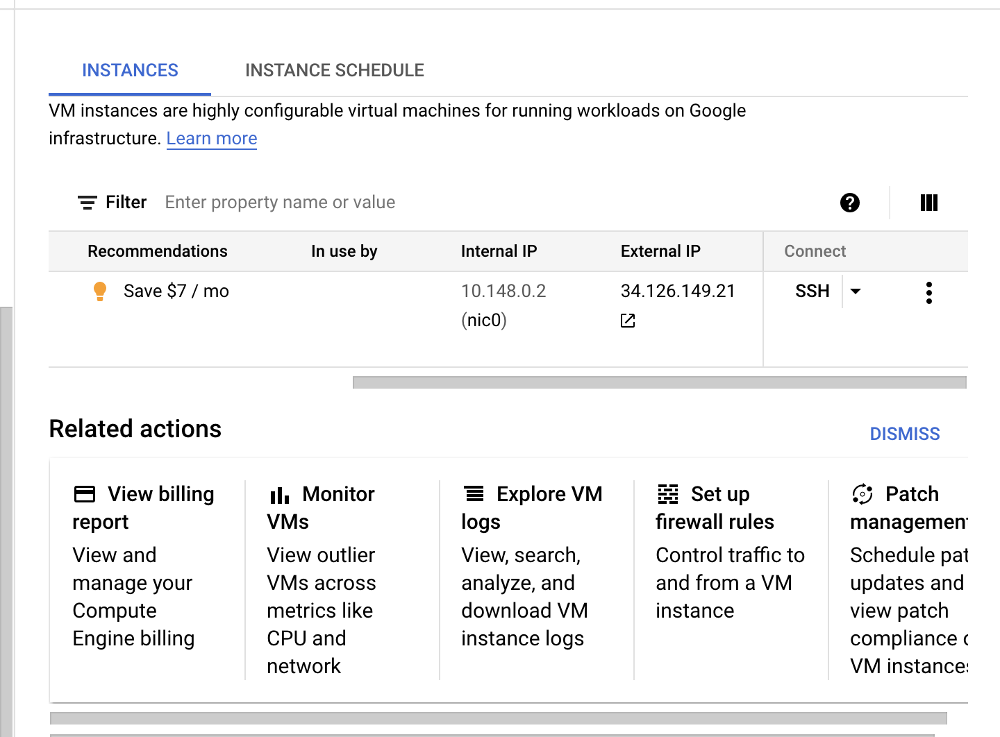

- **이제 콘솔에서 설치.**

  Cent-os에는 Yum이 들어있다. 

   ```livescript
  sudo yum -y install epel-release
  
  sudo yum install -y https://repo.ius.io/ius-release-el7.rpm
  sudo yum update
  
  # 이제 파이썬이 찾아짐. 
  sudo yum list "*python36*"
  
  sudo yum install -y python36u python36u-libs python36u-devel python36u-pip
   ```

  

  가상환경 설정

  ```
  # python3.6 -m pip or pip3.6으로 실행
  sudo python3.6 -m pip install virtualenv 
  
  sudo python3.6 -m pip install -U pip # pip upgrade
  ```

- 그 다음 내 코드 파일 압축(가상환경 제외)

  콘솔에서 upload file

  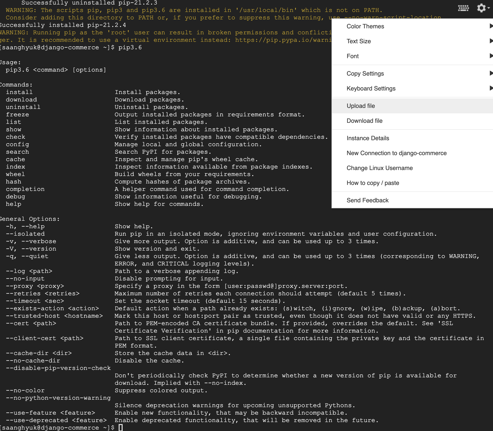

- 이제 압축 풀어야지. 근데 압축 푸는 명령어가 없음. 

  ```
  unzip이 없어서 그것부터 설치해야 함. 
  sudo yum -y install unzip
  
  ```

  ```
  mkdir flask_slack
  mv Archive.zip flask_slack/
  
  unzip Archive.zip 
  ```

  

  가상환경 설치. 

  ```
  python3.6 -m virtualenv flask_env
  source flask_env/bin/activate
  ```

  필요한 패키지 설치 

  가상환경 켜있으면, python/pip 실행해도 그냥 3대로 실행됨. 

  ```
  pip install flask requests
  ```

  실행

  ```
  python app.py
  ```

  


- 근데 이 상태로 외부 IP눌러도 연결할 수 없다고 나옴. 

  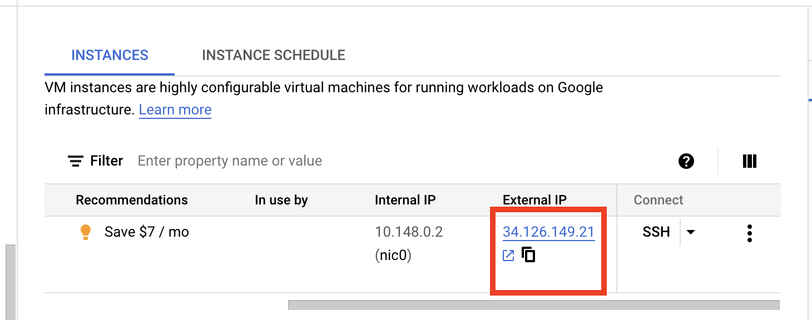

  **방화벽을 꺼야함.**

  ```
  sudo systemctl stop firewalld
  ```

   근데 그렇게 해도 안될거임. 

  근데 보면, 지금 코드에, 127.0.0.1:5000이라고 써져있음. 

  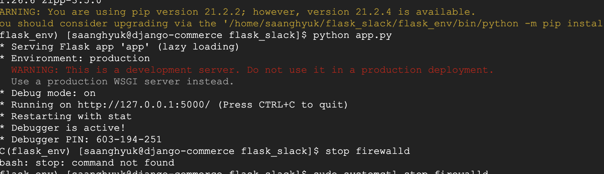

  바꿔줘야지. 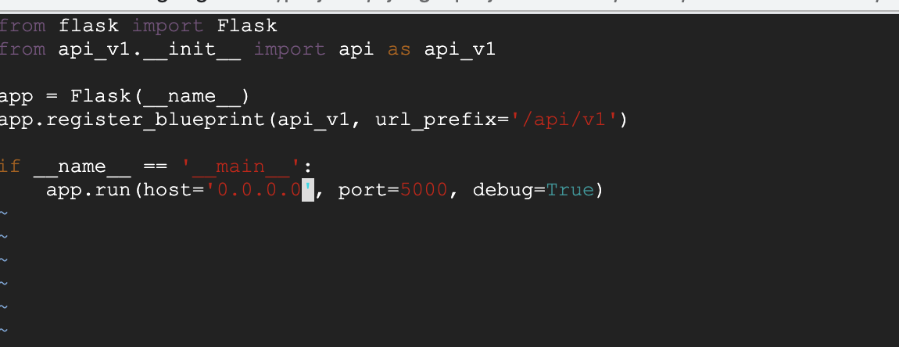

  **근데 사실, 이렇게 해도 안돼.**

  또 설정해야함. 운영체제의 방화벽은 껏지만, 

  내부 IP **nic0** 클릭

   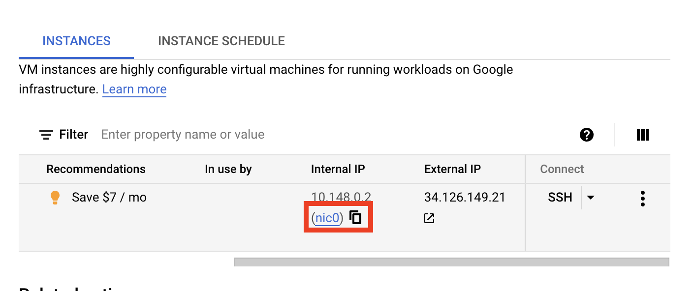

  ​	그 다음 왼쪽에 expernal ip address누르면, 

  

  TYPE밑에 고정/임시 바꿀 수 있던데 나는 못바꾸게 나오네, RESERVE 했음. 그러니깐 됬음. 

  ​	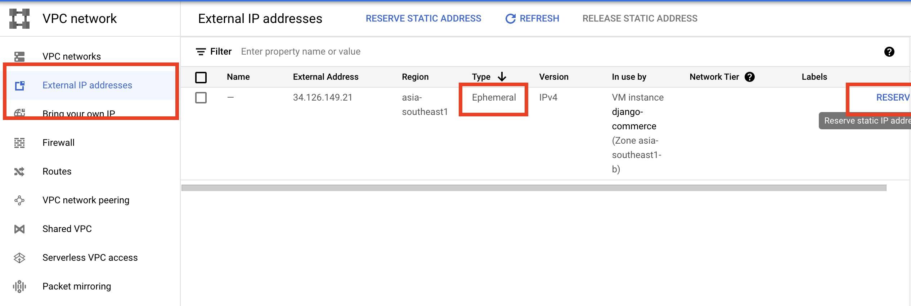

  Firewall -> CREATE FIREWALL RULE

  ​	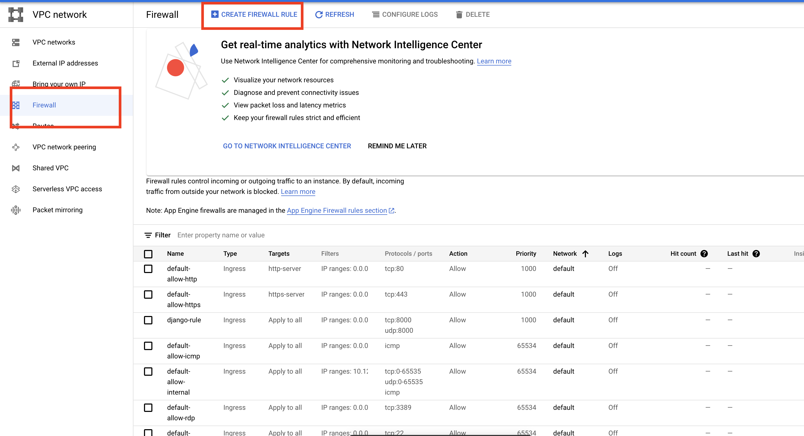

  아래 세 부분 수정 

  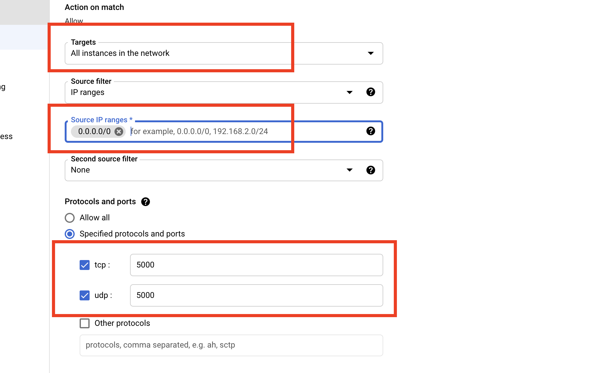

  이제 다시 아까 nic0로 가보면, Flask-test까지 들어와있는 것을 확인가능. 

  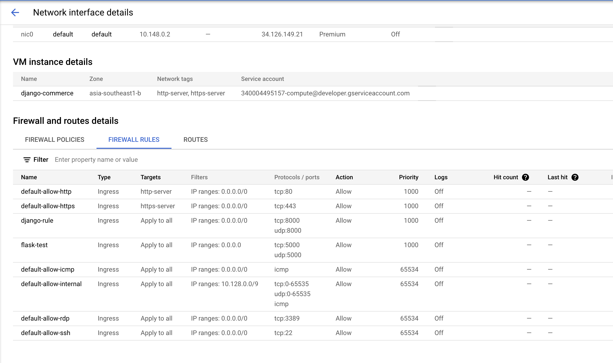


- requirements에 패키지 dependency담아놓은 경우.

  pip3 install < requirements.txt 


- #### 딱 여기까지만 하면, 계속 켜놓을 수가 없음. uwgi를 사용하는게 마무리 단계

  ```
  sudo yum -y install gcc python36u-devel
  ```

  

  ```
  python3 -m pip install uwsgi
  ```

  **uwsgi라는 명령어가 생긴다.**

  가상환경 내부로 들어간다. 정상적인 상황이면, 가상환경 bin 안에 uwsgi라는 명령어가 생긴다. 

  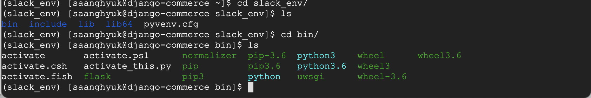

  ```
  uwsgi --http :5000 --home ~/slack_env --module app --callable app
  ```

  지금 이 실행을, app이 있는 곳 안에서 하면 된다. 명령어는 어차피 먹어. bin에 있다는거는 명령어가 있다는 거야. 

  이제 이거 데몬으로 배포만 하면 된다. 

  ```
  nohub uwsgi --http :5000 --home ~/slack_env --module app --callable app &
  ```

  ```
  ps -ef | grep '' # 이런식으로 확인 가능
  ```

  nohub 안써도 &만 쓰면 백그라운드 실행 되긴 하는데 nohub을 하면 꺼도 된다. 

  ```
  nohup uwsgi --http :5000 --home ~/slack_env --module app --callable app > output.txt &
  ```

  꺽쇠를 쓰면, 결과값을 해당 파일에 저장해 준다. 

  그리고 nohup명령어 칠때 나오는 숫자가 이 프로그램 번호야 

  ```
  ps -ef | grep '숫자' # 이런식으로 확인 가능
  ```


- 더 나은 백그라운드 프로그램들도 있다. 

  **supervisor**

